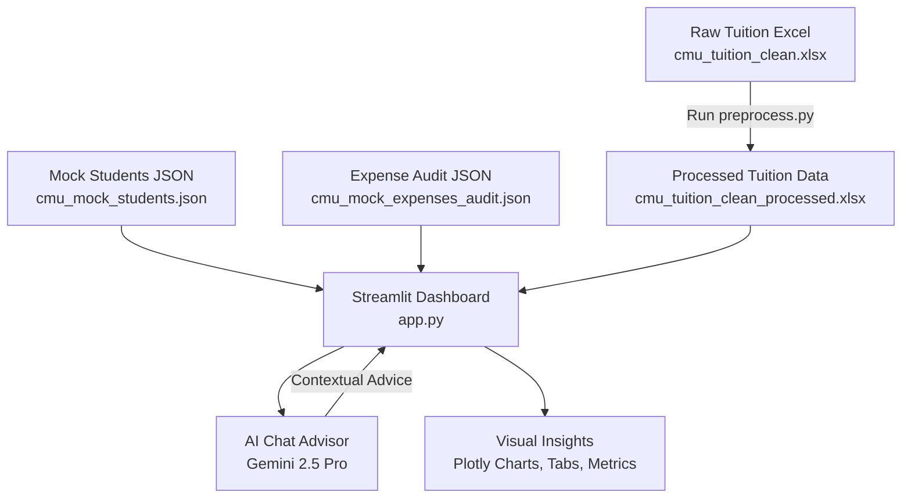
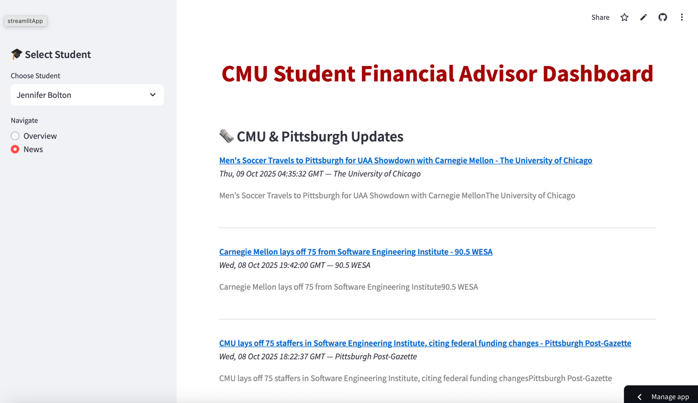
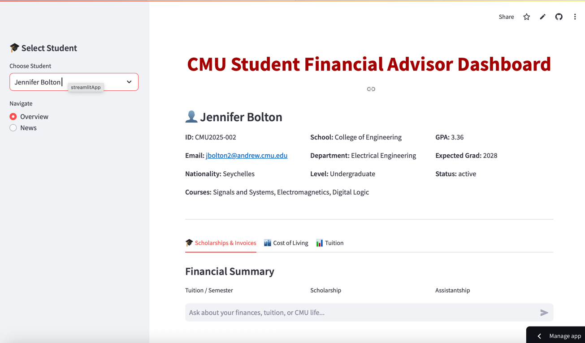
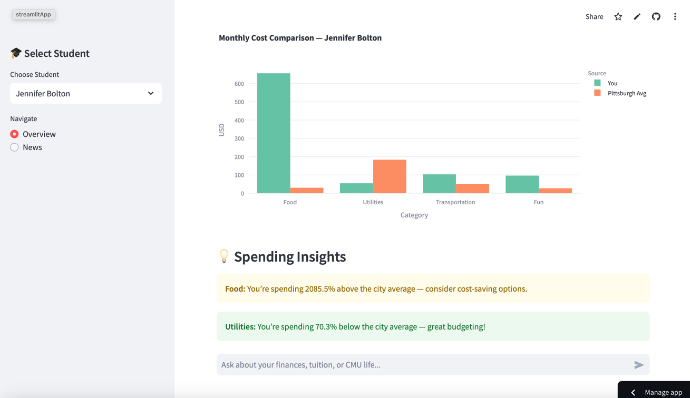
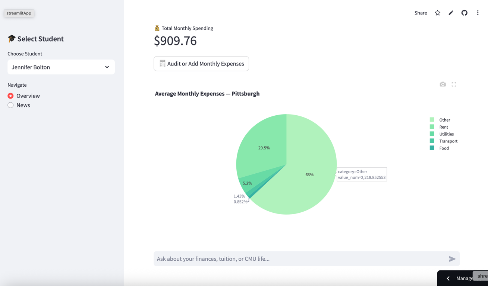

# 🎓 CMU Student Financial Advisor Dashboard

An intelligent, data-driven financial advisory dashboard built using **Streamlit** and **Google Gemini**, simulating real-world Carnegie Mellon University student financial management, including tuition breakdowns, scholarships, living costs, and AI-guided financial insights.

Link for the app: https://brokcmu.streamlit.app

---

### **👥 Team Information**

**Course:** *95-888 – Data Focused Python*  
**Semester:** *Fall 2025 – Section B1*  

**Team Name:** FinSmart CMU  

| Name | Andrew ID |
|:------------------|:-----------|
| Meghana Dhruv | **meghanad** |
| Yiying Lu | **yiyinglu** |
| Shreya Verma | **shreyave** |
| Mengzhang Yin | **mengzhay** |
| Malikah Nathani | **mnathani** |

---

## 🧭 Overview

The **CMU Student Financial Advisor Dashboard** provides a unified interface for analyzing:
- Student tuition and scholarships  
- Monthly on/off-campus expenses  
- Pittsburgh cost-of-living comparisons  
- Personalized AI-powered budgeting advice  

The system combines **data preprocessing**, **Streamlit visualization**, and **Gemini model reasoning** into one cohesive ecosystem.

---

## 🏗️ Project Structure

```
brok/
│
├── data/
│   ├── cmu_mock_students.json              # Mock CMU student profiles (50)
│   ├── cmu_mock_expenses_audit.json        # Monthly student expenses (food, rent, fun, etc.)
│   ├── cmu_tuition_clean.xlsx              # Raw tuition data (input)
│   └── cmu_tuition_clean_processed.xlsx    # Cleaned tuition (output of preprocess.py)
│
├── scrapers/
│   ├── cmu_tuition.py                      # Tuition data extraction and transformation
│   ├── cost_of_living.py                   # Fetches Pittsburgh cost of living
│   ├── loans.py                            # Mock loan data or API integration
│   └── news.py                             # Fetches CMU and finance-related news
│
├── services/
│   ├── budget_engine.py                    # Handles financial optimization and summaries
│   └── gemini_client.py                    # Gemini API interface for AI chat
│
├── utils/
│   ├── caching.py                          # Caching utilities
│   ├── charts.py                           # Plotly chart creation helpers
│   ├── parsing.py                          # Regex and data extraction tools
│   ├── preprocess.py                       # Tuition preprocessing pipeline (run manually)
│   └── tuition.py                          # Tuition normalization, deduplication, and filtering
│
├── app.py                                  # Streamlit main app (UI, chat, dashboard)
├── config.py                               # Configuration constants and GEMINI_API_KEY
├── mock_genai.py                           # Offline Gemini test client
├── .env                                    # Environment variables (Gemini API key)
└── requirements.txt                        # Python dependencies
```

---

## 🔁 System Flow Diagram



---

## ⚙️ Installation & Setup

### 1️⃣ Clone Repository

```bash
git clone <your_repo_url>
cd brok
```

### 2️⃣ Create & Activate Virtual Environment

```bash
python3 -m venv .venv
source .venv/bin/activate    # macOS/Linux
# or
.venv\Scripts\activate       # Windows
```

### 3️⃣ Install Dependencies

```bash
pip install -r requirements.txt
```

### 4️⃣ Configure Environment Variables

Create a `.env` file in the project root and add your Gemini API key:

```env
GEMINI_API_KEY=your_google_gemini_api_key_here
```

Alternatively, update `config.py` to include your key directly.

---

## 🧹 Data Preprocessing (Must Run Before Streamlit)

Before launching the app, **tuition data must be cleaned and saved** into `data/cmu_tuition_clean_processed.xlsx`.

### Run Preprocessing Script

```bash
python -m brok.utils.preprocess
```

✅ This will:
- Load the raw tuition file: `data/cmu_tuition_clean.xlsx`  
- Normalize and deduplicate units (e.g., per credit, per semester)  
- Save the cleaned version to:  
  `data/cmu_tuition_clean_processed.xlsx`  

Once done, this file becomes the primary tuition data source for `app.py`.

---

## 🚀 Running the Application

After preprocessing is complete, start the Streamlit dashboard:

```bash
streamlit run app.py
```

Then open the displayed URL (usually `http://localhost:8501`) in your browser.

---

## 🧩 Dashboard Features

| Section | Description |
|----------|-------------|
| **Overview Page** | Displays selected student details and academic info |
| **Scholarships & Invoices Tab** | Shows tuition per semester, scholarships, assistantships, and invoice summaries |
| **Cost of Living Tab** | Visual comparison of student vs. Pittsburgh expenses (on-campus vs. off-campus) |
| **Tuition Tab** | Displays program-specific tuition breakdown by unit (semester, year, etc.) |
| **AI Advisory Chat** | Context-aware Gemini chat offering budgeting and financial tips |
| **News Page** | Fetches CMU and financial news from online sources |

---

## 💬 Gemini AI Advisor

The **AI financial chat system** is powered by **Google Gemini 2.5 Pro** and uses contextual prompts built from:
- Student profile data  
- Monthly expense breakdown  
- Tuition and scholarship details  
- Pittsburgh cost-of-living averages  

Each student has an independent chat session.  
When a new student is selected, the chat history resets automatically.

If `GEMINI_API_KEY` is not configured, a warning will appear and the assistant will be disabled.

---

## 📊 Data Summary

| File | Purpose |
|------|----------|
| `cmu_mock_students.json` | Mock student dataset with demographics and academic details |
| `cmu_mock_expenses_audit.json` | Monthly breakdown of spending (rent, food, transport, etc.) |
| `cmu_tuition_clean.xlsx` | Raw tuition dataset (source) |
| `cmu_tuition_clean_processed.xlsx` | Cleaned tuition dataset (output of preprocessing) |

---

## 🧠 Workflow Summary

1. **Run tuition preprocessing:**  
   Clean and prepare tuition dataset.

2. **Start Streamlit app:**  
   Loads students, tuition, and expense JSONs.

3. **Select a student:**  
   View academic details and financial overview.

4. **Explore tabs:**  
   - Scholarships & invoices  
   - Cost of living comparison  
   - Tuition breakdown  

5. **Chat with AI:**  
   Ask financial questions — Gemini responds contextually using your data.

6. **View CMU News:**  
   Stay updated with CMU and Pittsburgh finance headlines.

---

## 🧰 Developer Notes

- You can test without an API key using `mock_genai.py`.  
- Extend budget optimization via `services/budget_engine.py`.  
- Adjust caching and plotting in `utils/` for performance.  
- Cost-of-living visualizations are built with Plotly (dynamic updates supported).

---

---

## 🧠 Acknowledgments & Citations

### **Generative AI Use Disclosure**
This project was developed with limited assistance from **OpenAI ChatGPT (GPT-5)** to:
- Draft system architecture and initial file structure
- Generate mock student and expense JSON data
- Refine documentation (README) and system diagram formatting
- Improve code readability and commenting consistency

All final Python logic, integration, debugging, and implementation were completed independently by the project team.  
AI outputs were verified, edited, and aligned with Carnegie Mellon University’s **Tier-4 “Integrated GenAI for Professional/Proficient Use”** guidelines.

> **Tool Used:** OpenAI ChatGPT (GPT-5)  
> **Accessed via:** [https://chat.openai.com](https://chat.openai.com)  
> **Model Release:** October 2025  

---

### **External Data & Web Sources**
| Source | Purpose | Citation |
|:--------|:---------|:----------|
| **Carnegie Mellon University Official Tuition Pages** | Tuition rates and sample program fees for tuition preprocessing | [https://www.cmu.edu/sfs/tuition/](https://www.cmu.edu/sfs/tuition/) |
| **Numbeo – Cost of Living in Pittsburgh** | Used to simulate average rent, food, and utilities costs in `scrapers/cost_of_living.py` | [https://www.numbeo.com/cost-of-living/in/Pittsburgh](https://www.numbeo.com/cost-of-living/in/Pittsburgh) |
| **CMU News RSS Feed** | Source for `scrapers/news.py` to fetch campus and financial news | [https://www.cmu.edu/news/rss](https://www.cmu.edu/news/rss) |
| **Google Gemini API Documentation** | Used for `gemini_client.py` integration with Gemini 2.5 Pro model | [https://ai.google.dev/](https://ai.google.dev/) |
| **Streamlit Documentation** | Used to develop the interactive dashboard and multi-page app | [https://docs.streamlit.io/](https://docs.streamlit.io/) |
| **Plotly Express Documentation** | For data visualization and analytics | [https://plotly.com/python/plotly-express/](https://plotly.com/python/plotly-express/) |
| **Pandas Documentation** | For all data cleaning and manipulation operations | [https://pandas.pydata.org/docs/](https://pandas.pydata.org/docs/) |

---

### **Python Libraries Used**
| Library | Purpose |
|:----------|:----------|
| `streamlit` | UI rendering and dashboard framework |
| `pandas` | Data wrangling and tabular processing |
| `plotly.express` | Visualization of tuition and expenses |
| `google-generativeai` | Gemini API integration |
| `openpyxl` | Excel file reading and writing |
| `requests` | HTTP data requests for scrapers |
| `beautifulsoup4` | Web scraping and HTML parsing |
| `python-dotenv` | Secure environment variable management |

---
## 📸 Screenshots






## 🧾 License

**MIT License © 2025 brok@CMU**
